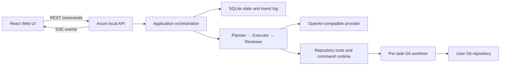
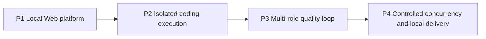

# NGY Coding Agent 产品路线图设计

> 日期：2026-07-14
> 状态：历史路线图；Project 1–4 已按后续各项目批准范围完成并通过验收
> 本文用途：固定产品边界、跨项目架构和实施顺序。每个项目开始实现前，仍需单独完成规格与实现计划。
> 2026-08-29 范围修订：已批准的 Project 4 仅由 P4-A + P4-B 组成；原草案中的历史/构件生命周期归未来 P4-C，发行包装、全链路脱敏与真实 provider 加固归未来 P4-D。本文正文已按该后续批准边界归一化；修订前的原始路线图记录由 Git 历史保留。

## 1. 产品目标

从零构建一个本地优先的 Coding Agent。用户通过 Web UI 选择真实 Rust Git 仓库、描述任务，Agent 在隔离环境中读取、修改和测试代码，并把计划、活动、差异、测试与审查证据持续展示出来。

第一版的最终体验是：

1. 用户双击本地应用，浏览器自动打开三栏工作台。
2. 用户添加一个或多个 Rust Git 仓库，并可同时创建多个任务。
3. 每个任务在独立 Git worktree 和任务分支中执行。
4. Planner、Executor、Reviewer 依次工作，彼此使用隔离上下文。
5. Agent 可直接读取、修改和运行命令，不对每个动作弹出确认。
6. Reviewer 通过后，任务分支与 worktree 保留；用户从 Web UI 主动发起合并。
7. 关闭或刷新浏览器不终止任务；应用重启后，未完成任务显示为 `Interrupted`，由用户选择重新运行。

## 2. 已确定的产品边界

### 2.1 技术边界

- 后端、Agent 内核与本地运行时使用 Rust。
- 前端使用 React、TypeScript 与 Vite，不在浏览器端使用 Rust/WASM。
- 本地 HTTP 服务使用 Axum。
- 命令接口使用 REST，实时事件使用 SSE。
- SQLite 是任务、仓库与事件的权威状态源。
- OpenAPI 是前后端 DTO 的契约源，TypeScript 类型由它生成。
- 应用核心是各目标平台上的单个本地可执行文件，内嵌 React 生产资源；安装器、macOS app bundle、Linux desktop entry 与签名等平台包装属于未来 P4-D，不属于 Project 4。
- 支持 Windows、macOS 与 Linux。

React 官方把 Vite 列为从零搭建 React 应用的可选构建工具；Vite 的生产构建输出适合被后端作为静态资源发布。相关依据见 [React: Build a React app from Scratch](https://react.dev/learn/build-a-react-app-from-scratch)、[Vite: Building for Production](https://vite.dev/guide/build) 与 [Vite: Static Asset Handling](https://vite.dev/guide/assets.html)。Axum 的路由、提取器、响应与 SSE 能力以其 [官方 crate 文档](https://docs.rs/axum/latest/axum/) 为准。

### 2.2 Agent 行为边界

- 第一版不提供逐工具确认或审批队列；任务启动后，Agent 在任务 worktree 内拥有完整读写与命令执行能力。
- “无需确认”不等于自动合并。创建、取消、重试与合并仍是用户在 Web UI 发起的高层命令。
- Agent 默认只修改任务 worktree，不直接修改用户原始工作目录或默认分支。
- 模型接口面向可配置的 OpenAI-compatible 服务；三种角色可共享同一个 provider 配置，但会话上下文必须隔离。
- 第一版先固定兼容子集，再扩展 provider 特性，不以某一厂商私有行为作为核心状态机前提。

### 2.3 交互边界

- 本地单用户应用，仅监听 loopback，不提供账号系统或远程多人协作。
- 主界面是桌面优先的三栏工作台：左侧仓库与任务，中间计划与活动，右侧差异、测试和证据。
- 后端任务生命周期独立于浏览器连接。
- 同一仓库允许并发任务；隔离单位是一任务一 worktree 一任务分支。

## 3. 跨项目架构

必须长期保持的依赖规则：

- 领域状态不依赖 Axum、SQLite、Git 或模型 SDK。
- HTTP/SSE 只是应用命令与事件的传输层，不拥有任务状态机。
- SQLite 负责持久事实；内存广播只负责降低实时延迟。
- Task 的 `Completed` 只表示本次 runner 成功结束，不等于 Reviewer 已批准、可交付或可合并。
- Agent 内核通过明确端口使用 provider、仓库工具、进程执行与制品存储。
- worktree 是代码执行边界；角色上下文是模型推理边界；两者不能混为一层。
- 控制动作（提交计划、完成步骤、提交审查）由 Agent 编排器解释，不注册为可执行操作系统工具。
- 最终通过证据必须绑定到最终工作区版本；代码再次变化后，旧测试结果不能满足完成条件。

## 4. 四个实施项目

### Project 1：本地 Web 平台

交付可直接启动、全程通过 Web UI 交互的本地 React/Axum 核心应用，先用确定性的 `FakeTaskRunner` 验证平台能力；三平台的双击 launcher/安装包装留给未来 P4-D：

- React 三栏工作台；
- 仓库登记与本地目录选择；
- 多任务排队、并发、取消与重试；
- SQLite 持久化；
- REST 快照与 SSE 增量事件；
- 浏览器断开后后台继续；
- 应用重启后未完成任务转为 `Interrupted`；
- loopback 会话、CSRF、Origin/Host 与静态资源安全；
- React 资源内嵌进 Rust 发布二进制。

Project 1 不调用模型、不修改仓库、不创建 worktree。它建立后续项目共用的 UI、状态与运行骨架。完整规格见 `2026-07-14-local-web-platform-design.md`。

### Project 2：隔离式 Coding 执行

用真实 `CodingAgentRunner` 的单角色最小闭环替换假执行器，重点解决代码操作而非多角色推理：

- 为每个任务创建任务分支与 Git worktree；
- 读取文件、搜索、列目录、应用补丁与运行命令；
- Rust 仓库发现、Cargo workspace 感知和测试命令；
- 命令超时、取消、输出上限、子进程树清理与跨平台行为；
- 工作区路径约束、敏感环境变量隔离和日志脱敏；
- provider 抽象与一个明确的 OpenAI-compatible 兼容子集；
- 原子修改语义明确为“单文件安全替换”，不承诺跨文件崩溃事务；
- 使用本地 mock HTTP provider 的离线端到端测试。

本项目结束时，一个任务能在 worktree 中完成“读取—修改—测试”，但还不声称具备 Planner/Reviewer 质量闭环。Project 2 的真实 runner 暂时限制为全局单任务执行；P1 的四路并发只用于 Fake runner。真实任务并发、同仓库协调和应用管理范围内的资源准入由后续 P4-A 批准后打开；这不等于 OS 或宿主磁盘硬配额。

### Project 3：多角色质量闭环

在隔离执行之上加入三角色顺序编排：

- Planner 产出结构化计划；
- Executor 按计划修改与验证；
- Reviewer 以隔离上下文检查差异和证据；
- 审查失败进入有上限、无歧义的返工循环；
- 完整定义所有成功、失败、取消、阻塞与超限状态转换；
- 证据记录工作区 generation 或 diff digest；
- 只有最终 generation 上的必需检查全部通过，任务才能进入可交付状态；
- 新增独立于 `TaskStatus` 的持久质量门 `delivery_readiness`；只有 Reviewer 在最终 generation 上批准才可为 `ReviewApproved`，旧任务或缺失该字段一律视为 `Unreviewed`；
- 延续 Project 2 已实现的有序多调用 transcript 与 `tool_call_id` 语义，并确保三个角色之间不共享或重排调用批次。

角色使用同一 provider 配置是允许的，但不得共享隐式对话历史。Reviewer 运行的命令仍只作用于任务 worktree。

### Project 4：受控并发与本地交付（P4-A + P4-B）

已批准的 Project 4 只包含两段：

- P4-A：对真实任务启用受控并发、同仓库准入、repository control、队列背压、存储压力准入和进程/重启恢复；这些是应用管理范围内的准入机制，不是 OS 或宿主磁盘硬配额。
- P4-B：在 Web UI 中提供显式的合并前检查、exact no-ff 本地合并、失败/崩溃恢复，以及合并后两个独立的 worktree/branch 清理动作；默认仍不 merge、不 cleanup。

以下原草案候选项不属于 Project 4，需以后续独立规格重新批准：

- P4-C：既有任务历史分页/搜索、真实构件大小、保留期、长期配额和批量/自动删除生命周期。
- P4-D：provider/命令全链路脱敏重构、动态设置、Windows/macOS/Linux 发行包装、签名/公证、自动更新和真实 provider 冒烟。

## 5. 项目依赖和验收门

每个项目都必须经过以下门禁，才进入下一项目：

1. 对话设计确认；
2. 书面规格复核；
3. 分步实现计划；
4. 测试驱动实现；
5. 独立代码审查；
6. 新鲜的验证命令与结果；
7. 项目验收演示。

前一项目的接口可以在后一项目规格中扩展，但不能静默改变已验收行为。需要破坏性变更时，先更新对应规格并说明迁移。

## 6. Project 1–4 已批准范围验收场景

Project 1–4（其中 Project 4 = P4-A + P4-B）已经全部完成，并通过以下已批准范围内的跨项目场景：

1. 双击应用后，仅在 `127.0.0.1` 随机端口打开受保护的 Web UI。
2. 添加两个真实 Rust Git 仓库，并在同一仓库创建两个并发任务。
3. 每个任务拥有独立分支和 worktree；原工作目录的未提交内容不会进入 Agent 执行上下文，也不被覆盖或清理。登记仓库时只允许只读发现 Git/Cargo 元数据。
4. Planner、Executor、Reviewer 的输入输出可追溯，Reviewer 不继承 Executor 的隐藏上下文。
5. 关闭浏览器后任务继续；重新打开后通过持久事件恢复完整视图。
6. 修改发生后，最终测试证据与最终 diff digest 一致。
7. 应用被强制终止后重启，未完成任务变为 `Interrupted`，worktree、日志与历史仍在。
8. 用户从 Web UI 重新运行中断任务；旧尝试保持只读可查看。
9. Reviewer 通过后不自动合并；用户执行合并，冲突时得到明确且可恢复的结果。P4 合并入口只接受显式 `ReviewApproved` 且证据绑定最终 generation 的任务，历史 `Completed` 任务默认不可合并。
10. 正常离线测试不访问外部模型服务；Project 4 不包含真实 provider 冒烟，相关能力留给未来 P4-D。

## 7. 已封存范围

2026-08-30 封存：本节原文只描述 2026-07-14 当时的授权边界，现由各项目后续批准并完成验收的规格与计划取代。Project 4 的已验收范围固定为 P4-A + P4-B；P4-C/P4-D 仍是未来独立项目，不能作为 Project 4 的未完成项或验收欠账。
