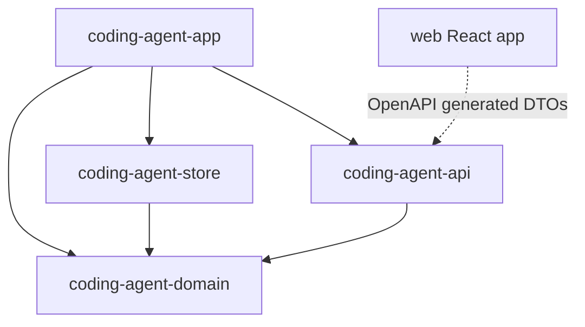
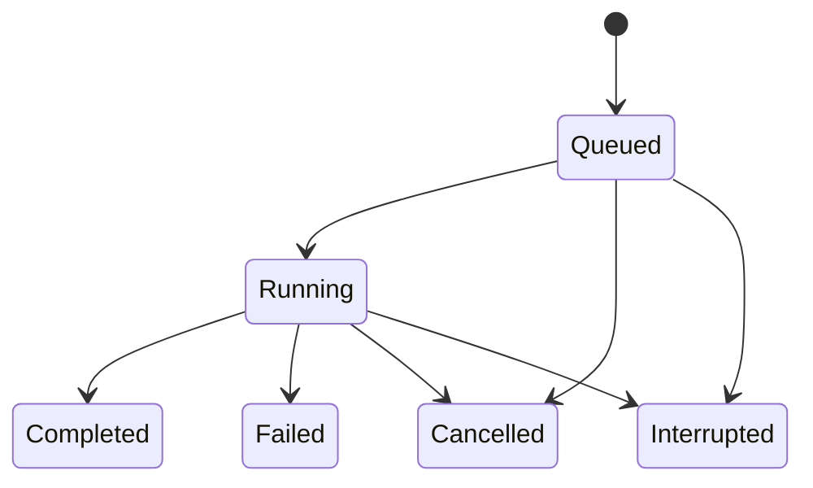

# Project 1：本地 Web 平台设计

> 日期：2026-07-14
> 状态：历史规格；Project 1 已完成并验收
> 上位文档：`2026-07-14-coding-agent-product-roadmap-design.md`
> 本文范围：只交付本地 Web 平台和确定性的假任务执行器，不实现真实模型、代码修改或 Git worktree。
> 2026-08-29 范围修订：本文保留的“发行包装留给 Project 4”等旧里程碑措辞按未来 P4-D 解释；P4-A + P4-B 才是后续批准的 Project 4。此注释不改写 Project 1 的历史 TDD 事实。

## 1. 摘要

Project 1 建立后续 Coding Agent 共用的平台骨架：一个可直接启动的 Rust 本地核心应用，在随机 loopback 端口提供内嵌的 React Web UI；用户可以登记多个 Rust Git 仓库、创建多个任务，并在三栏工作台中观察计划、活动、差异、测试和状态。

任务由确定性的 `FakeTaskRunner` 驱动。它只生成合成事件，不读取模型、不创建 worktree、不修改源代码。这样可以在引入高风险的代码执行前，单独验证后台任务、SQLite、REST、SSE、浏览器断线恢复、应用重启恢复和本地 Web 安全边界。

## 2. 目标与非目标

### 2.1 目标

- 直接启动原生可执行文件后自动打开本地 Web UI；不要求 CLI 参数，启动后的全部产品交互都在 Web UI 中完成。
- 使用 React、TypeScript、Vite 构建桌面优先的三栏工作台。
- 使用 Rust、Axum、Tokio 提供本地 HTTP 服务和后台任务管理。
- 使用 SQLite 持久化仓库、任务与事件。
- 支持多个仓库、多个任务和最多 4 个同时运行的假任务。
- 浏览器刷新、关闭或 SSE 断开时，任务继续运行。
- 应用进程重启后，原 `Queued`/`Running` 任务变为 `Interrupted`，保留历史并允许重新运行。
- 生产发布物内嵌 React 静态资源；运行时不需要 Node.js。
- 本地服务只接受当前进程建立的受保护浏览器会话。
- 为 Project 2 提供可替换的任务执行器接缝。

### 2.2 非目标

- 不调用 OpenAI 或任何其他模型服务。
- 不读取、修改或测试用户仓库中的源代码；仓库登记可以只读访问 Git/Cargo 元数据与 manifest 来定位 workspace，但不得写入仓库。
- 不创建 Git 分支或 worktree。
- 不实现 Planner、Executor、Reviewer。
- 不实现合并、冲突解决或 worktree 清理。
- 不支持远程访问、多人协作、登录账号或云同步。
- 不提供守护进程、自启动、系统托盘或后台服务安装。
- 不承诺历史清理和磁盘配额；Project 1 保留全部任务事件。

## 3. 用户体验

### 3.1 启动流程

1. 用户直接启动核心可执行文件。
2. 应用取得单实例锁、迁移 SQLite、修复上次未完成任务状态。
3. 应用绑定随机 `127.0.0.1` 端口并创建一次性启动令牌。
4. 应用打开系统默认浏览器，URL 形如 `http://127.0.0.1:{port}/#token={token}`。
5. React 从 fragment 读取令牌，交换为 HttpOnly 会话 cookie，立即从地址栏移除 fragment。
6. React 获取 bootstrap 快照并连接全局 SSE。
7. 页面显示三栏工作台。

浏览器自动打开失败时，应用显示原生错误对话框，其中包含可复制的完整本地 URL。失败不会终止已经启动的本地服务。

### 3.2 三栏工作台

左栏负责选择范围：

- “打开仓库”按钮；
- 已登记仓库列表；
- 当前仓库的任务列表；
- `Queued`、`Running`、`Completed`、`Failed`、`Cancelled`、`Interrupted` 状态；
- 中断或终态任务的“重新运行”入口。

中栏负责展示工作过程：

- 当前任务标题、prompt、attempt 与状态；
- 结构化计划；
- 按时间排序的活动流；
- 运行中任务的取消按钮；
- 新任务输入区。

右栏负责展示结果与证据：

- 合成 diff；
- 合成测试结果；
- 状态时间线与错误；
- 重试链和旧 attempt 的只读入口。

顶栏展示连接状态，并在应用菜单提供“退出本地应用”。该动作调用受保护的 quit API；普通的关闭标签页或浏览器窗口只断开 UI，不退出后端。

未选择任务时，中栏显示任务创建引导，右栏显示空状态。UI 以桌面宽度为主要目标；较窄窗口允许左右栏折叠，但 Project 1 不把手机布局作为验收门。

### 3.3 核心用户流程

添加仓库：

1. 用户点击“打开仓库”。
2. 后端打开原生目录选择器。
3. 用户选择目录。
4. 后端规范化路径，确认它位于 Git 仓库内且能定位 Rust Cargo workspace。
5. 若同一 Git root 与 Cargo workspace 已登记，直接选择现有记录；否则创建记录。

创建任务：

1. 用户选择仓库并输入非空任务描述。
2. 后端在一个 SQLite 事务中创建 `Queued` 任务及 `task.queued` 事件。
3. `TaskManager` 在并发名额可用时，以比较并交换方式把任务变为 `Running`。
4. `FakeTaskRunner` 依次产生计划、活动、diff 和测试事件。
5. 任务最终进入 `Completed`；失败、取消或 panic 则进入对应终态。

断线恢复：

1. 浏览器关闭不向后端发送取消命令。
2. 再次打开页面后先读取 REST 快照。
3. 页面从快照的最后事件游标连接 SSE，并去重应用增量事件。
4. 页面恢复时不依赖前一个浏览器实例的内存状态。

应用重启：

1. 新进程启动时，在一次恢复事务中把遗留 `Queued`/`Running` 任务变为 `Interrupted` 并写事件。
2. 这些任务不会自动重新入队。
3. 用户点击“重新运行”后创建一个新 attempt；旧 attempt 不变。

## 4. Workspace 与模块边界

```text
ngy-coding-agent/
├── Cargo.toml
├── Cargo.lock
├── crates/
│   ├── coding-agent-domain/
│   ├── coding-agent-api/
│   ├── coding-agent-store/
│   └── coding-agent-app/
├── web/
│   ├── package.json
│   ├── package-lock.json
│   ├── tsconfig.json
│   ├── vite.config.ts
│   └── src/
└── docs/
```

### 4.1 `coding-agent-domain`

拥有纯领域类型和规则：

- `Repository`、`Task`、`TaskStatus`、`TaskEvent`；
- 合法状态转换；
- retry 链规则；
- 领域错误码；
- 时间、ID 与路径的已验证值类型。

该 crate 不依赖 Axum、Tokio、SQLite、Git 命令或浏览器库。

### 4.2 `coding-agent-api`

拥有 HTTP/SSE 传输契约：

- Axum router；
- REST 请求与响应 DTO；
- SSE envelope；
- 统一错误响应；
- OpenAPI schema；
- router 所需的 `ApiBackend` 与 `RequestSecurity` 异步端口。

`coding-agent-api` 依赖 `coding-agent-domain`，但不依赖具体 SQLite 实现或 `coding-agent-app`。它通过自己定义的 `ApiBackend` 端口调用应用服务，并对全部 `/api` route 按端点分类统一调用 `RequestSecurity`，防止遗漏 auth/CSRF。`coding-agent-app` 实现这两个端口并持有实际秘密，依赖方向仍然只有 `app → api`，不会形成循环。

### 4.3 `coding-agent-store`

拥有 SQLite 持久化适配器：

- 内嵌迁移；
- repository、task、event 查询与事务；
- 状态转换的条件更新；
- 启动恢复；
- 用于 SSE replay 的事件读取。

它依赖 `coding-agent-domain`，不依赖 Axum 或 React。

### 4.4 `coding-agent-app`

是唯一原生二进制和 composition root，拥有：

- 启动、单实例、运行目录与 SQLite 路径；
- `ApiBackend` 实现；
- 串行任务控制的 `TaskManager` actor；
- 串行持久写入的 `StoreWriter` actor；
- 按 SQLite cursor 发布 live 事件的 `EventDispatcher`；
- 拥有唯一 watch sender、为状态转换递增 generation 的 `ServiceStateController`；
- 由持久事件生成 `TaskDetail` 的投影服务；
- 应用内部的 `TaskRunner` 端口与 `FakeTaskRunner` 实现；
- 遵循各平台主线程/事件循环要求的本地目录选择服务；
- 浏览器启动；
- 会话、CSRF、Host/Origin 校验；
- React 静态资源内嵌与 fallback；
- 优雅关闭。

Project 2 的真实 runner 通过 composition root 适配到同一 `TaskRunner` 行为接口；Project 1 不提前把真实 Agent 依赖引入平台 crate。

outer router 的职责也固定：`coding-agent-app` 在最外层执行所有请求的精确 Host guard，拥有 `/_local/*`、静态资源与 SPA fallback；它把 `/api/*` nest 到 `coding-agent-api`。API crate 拥有业务 route、DTO 映射和“哪些端点需要 session/CSRF”的统一中间件，具体 session/Origin/CSRF 判断由 app 的 `RequestSecurity` 实现完成。

### 4.5 `web`

拥有 React 单页应用：

- 三栏布局与交互；
- REST 客户端；
- SSE 连接与重连；
- 基于事件的幂等 reducer；
- OpenAPI 生成的 TypeScript DTO；
- Vitest/React Testing Library 与 Playwright 测试。

前端不得手写一份与 Rust DTO 平行的接口类型。Rust OpenAPI schema 是契约源，构建脚本使用 `openapi-typescript` 生成 `web/src/api/generated/`，生成文件提交到仓库，CI 重新生成后检查无差异。

### 4.6 依赖方向



## 5. 领域模型与状态机

### 5.1 Repository

```text
Repository {
  id: UUID
  selected_path: absolute canonical directory originally selected by user
  display_name: string
  git_root: absolute canonical Git root
  cargo_workspace_root: absolute canonical Cargo workspace root
  created_at: UTC timestamp
  last_opened_at: UTC timestamp
}
```

`selected_path` 只用于展示和再次打开，不参与身份判断；同一 workspace 从另一个 member 目录登记时可更新它。仓库身份由 `(git_root, cargo_workspace_root)` 的规范化组合唯一确定。持久层为两条身份路径派生平台相关 identity key：Windows 使用规范化后的大小写不敏感 key，Unix 保持大小写敏感；唯一约束建在 identity key 上，而不是未经处理的展示字符串上。再次选择同一 workspace 会更新 `last_opened_at` 并返回原记录，不创建重复项。

### 5.2 Task

```text
Task {
  id: UUID
  client_request_id: UUID
  repository_id: UUID
  prompt: string
  status: Queued | Running | Completed | Failed | Cancelled | Interrupted
  attempt: positive integer
  retry_of: UUID | null
  created_at: UTC timestamp
  started_at: UTC timestamp | null
  finished_at: UTC timestamp | null
  last_event_id: integer
  failure: TaskFailure | null
}
```

`TaskFailure { code, message, retryable }` 是领域类型，不包含 HTTP request ID 或传输层 details。`coding-agent-api` 把领域失败映射成 Task DTO；请求本身失败时才使用后文的 `ApiErrorResponse { code, message, retryable, request_id, details }`，领域 crate 不依赖或命名任何 API 类型。

`Completed` 的语义仅是“本次 TaskRunner 成功返回并完成平台生命周期”，不表示代码质量门、Reviewer 批准、可交付或可合并。Project 1/2 的 `Completed` 默认都是 `Unreviewed`；Project 3 另行增加持久 `delivery_readiness`，Project 4 的合并入口不得仅凭 `TaskStatus::Completed` 放行。

初次任务 `attempt = 1`、`retry_of = null`。retry 创建新任务，复制 repository 与 prompt，`attempt = source.attempt + 1`，`retry_of = source.id`。一个任务最多拥有一个直接 retry；重复请求返回已经创建的 retry，因此双击不会产生并列的同号 attempt。再次重试时以新的 attempt 为 source，形成线性链。

初次 `client_request_id` 由 React 在一次提交动作开始时生成，并在网络重试中复用。相同 ID 与相同 repository/prompt 返回原 Task；相同 ID 搭配不同内容返回 `409 IDEMPOTENCY_CONFLICT`。retry task 的 ID 由服务端创建，并由唯一 `retry_of` 提供等价的幂等保证。

### 5.3 状态转换



所有终态不可原地改变。重新运行永远创建新 `Task`，不会把旧任务改回 `Queued`。

状态规则：

- `Queued → Running` 必须是条件更新；若取消先提交，worker 不能再启动它。
- `Queued → Cancelled` 在一个事务中完成状态与事件写入。
- `Running` 的取消先触发内存 cancellation token；runner 退出后提交 `Cancelled`。
- 对已 `Cancelled` 任务再次取消是幂等成功。
- 对 `Completed`、`Failed`、`Interrupted` 取消返回 `409 TASK_NOT_CANCELLABLE`。
- 只有终态任务可 retry；`Queued` 或 `Running` 返回 `409 TASK_NOT_RETRYABLE`。
- 启动恢复是 `Queued/Running → Interrupted` 的唯一常规路径；优雅关闭也执行同一恢复写入。

### 5.4 TaskEvent

```text
TaskEvent {
  id: global monotonically increasing integer
  schema_version: 1
  task_id: UUID
  kind: event kind
  payload: kind-specific typed object
  created_at: UTC timestamp
}
```

在 Rust 与 OpenAPI 中，`TaskEvent` 不是“字符串 + 任意 JSON”，而是以 `kind` 为 discriminator 的 tagged `oneOf`。每个 variant 固定自己的 payload：task lifecycle 事件携带 `{ task }`；`plan.updated` 携带 `{ plan: PlanSnapshot }`；`activity.appended` 携带 `{ entry: ActivityEntry }`；`diff.updated` 携带 `{ diff: DiffSnapshot }`；`test.updated` 携带 `{ tests: TestSnapshot }`。

Project 1 的最小面板 DTO 固定为：`PlanSnapshot { revision, items[{ id, title, status }] }`，plan item status 为 `pending|running|completed`；`ActivityEntry { id, level, message, created_at }`，level 为 `info|warning|error`；`DiffSnapshot { revision, files[{ path, status, patch, additions, deletions }] }`；`TestSnapshot { revision, status, cases[{ id, name, status, duration_ms, summary }] }`；`TimelineEntry { event_id, kind, label, created_at, failure }`。timeline 只投影 task lifecycle 事件，`failure` 仅在失败/中断相关条目存在。diff file status 为 `added|modified|deleted`，test/case status 为 `queued|running|passed|failed|cancelled`。这些都是版本化 DTO，由 OpenAPI 生成到 TypeScript；前端不使用 `Record<string, unknown>` 代替它们。

SSE 的传输联合类型是 `oneOf(TaskEvent, StreamResetControl, ServiceStateControl)`；`StreamResetControl` 固定为 `{ schema_version: 1, kind: "stream.reset", latest_event_id }`，`ServiceStateControl` 固定为 `{ schema_version: 1, kind: "service.state", state, generation }`，其中 state 为 `ready|store_degraded|quiescing`，generation 是当前进程内单调递增的 u64。两个 control variant 都不具有持久 event ID。运行时解析器对未来未知 discriminator 做安全 fallback，但当前生成契约必须穷举所有 v1 variant。

持久事件类型：

- `task.queued`
- `task.started`
- `plan.updated`
- `activity.appended`
- `diff.updated`
- `test.updated`
- `task.completed`
- `task.failed`
- `task.cancelled`
- `task.interrupted`

`plan.updated`、`diff.updated` 与 `test.updated` 携带对应面板的完整最新快照，使重复应用事件保持幂等。`activity.appended` 携带具有稳定 entry ID 的单条记录，前端按事件 ID 与 entry ID 去重。所有 task 终态事件携带完整的最新 `Task` 摘要。

## 6. 仓库发现与登记

所有入口都使用同一验证流程，目录选择器不拥有另一套规则：

1. 要求输入存在且是目录。
2. 对输入执行绝对路径规范化，解析 `.`、`..` 和符号链接。
3. 运行 `git -C <selected> rev-parse --show-toplevel`，取得并规范化 Git root。
4. 从 selected 目录向上查找 `Cargo.toml`，最远到 Git root；选择遇到的第一个 manifest。
5. 从应用 runtime 目录这一中立 working directory 运行 `cargo locate-project --workspace --manifest-path <manifest> --message-format plain`；不把用户仓库设为进程 cwd，也不触发仓库内 `rust-toolchain` 的自动安装流程。该子命令只定位 workspace manifest，不解析依赖、构建代码或更新 lockfile。
6. 从命令结果取得并规范化 Cargo workspace root，要求它位于 Git root 内。
7. 用 `(git_root, cargo_workspace_root)` 查询或创建 Repository。

发现流程只允许上述 read-only Git/Cargo 操作。它在缺失、过期或带未提交改动的 `Cargo.lock` 场景都不得创建或改写文件；集成测试在调用前后比较仓库文件清单、关键文件字节与 `git status --porcelain=v1`。Cargo workspace 定位语义以 [Cargo 官方 `locate-project` 文档](https://doc.rust-lang.org/cargo/commands/cargo-locate-project.html) 为准。

如果用户选择 Git root，但 Rust workspace 位于未被上述向上搜索覆盖的子目录中，返回 `CARGO_WORKSPACE_NOT_FOUND`，提示用户选择具体 Rust workspace 目录；Project 1 不猜测多个嵌套 workspace 中哪一个是目标。

`POST /api/repositories/pick` 把请求交给 `NativeDialogService`。该服务按平台要求把对话框调度到主线程或所需事件循环，HTTP handler 异步等待结果，不假设任意 Tokio worker 可以直接打开原生 UI。同一时刻只允许一个选择器；已有选择器时返回 `409 PICKER_ALREADY_OPEN`。用户取消选择返回 `204`，不是错误。

## 7. HTTP API

### 7.1 通用规则

- JSON 使用 UTF-8 和 `snake_case` 字段。
- ID 使用 UUID 字符串，时间使用 UTC RFC 3339。
- 成功创建返回 `201`；同步查询返回 `200`；已接受但等待 runner 响应的取消返回 `202`。
- 每个响应包含 `X-Request-Id`；客户端未提供时由服务端生成。
- 除一次性会话交换和原生 secondary-instance 重开端点外，所有 `/api/*` 都要求有效会话 cookie。
- 所有修改状态的请求还要求精确 Origin 与 `X-CSRF-Token`。

统一错误响应：

```json
{
  "code": "TASK_NOT_RETRYABLE",
  "message": "Only terminal tasks can be retried.",
  "retryable": false,
  "request_id": "uuid",
  "details": {}
}
```

`message` 可直接展示给用户但不包含秘密或未经处理的底层命令输出；`code` 是前端分支判断的稳定接口。

### 7.2 会话端点

`POST /api/session/exchange`

- body：`{ "token": "..." }`
- 要求精确 Host 与当前 public Origin。
- 令牌仅成功使用一次，成功后立即从内存中删除。
- 一次性令牌创建后 2 分钟过期；并发交换只有一个请求能成功。
- 每次成功交换都创建独立的内存 session ID 与 CSRF token，并设置 process-scoped、host-only、`HttpOnly`、`SameSite=Strict`、`Path=/` cookie。
- loopback HTTP 下不设置会使浏览器拒收的 `Secure` 属性；应用不接受非 loopback 连接。
- 成功返回 `204`。

`POST /_local/reopen`

- 只供第二个原生进程调用，不供 React 使用。
- secondary instance 从仅当前 OS 用户可读的 runtime descriptor 取得 process-scoped launcher secret。
- primary 验证 secret 后签发一个新的单次浏览器交换令牌并返回完整 fragment URL。
- 成功返回 `200 { "url": "...", "expires_at": "..." }`；secret 错误返回 `401`，primary 尚未 ready 返回 `503`。
- secondary 打开该 URL 后退出。
- launcher secret 不进入 URL、普通日志或 SQLite。

`GET /_local/ready` 同样要求 `X-Launcher-Secret`，只返回 `{ instance_id, state }`，不返回路径、session 或 task 数据。primary 用它完成自探针，secondary 用它校验 descriptor 指向的仍是同一实例。`Starting` 状态只开放此探针；`/_local/reopen` 仅在 `Ready` 状态签发 token。

### 7.3 Bootstrap 与仓库端点

`GET /api/bootstrap`

返回：

```text
BootstrapResponse {
  csrf_token
  repositories[]
  tasks[]
  latest_event_id
  server_started_at
  service_state
  service_state_generation
  max_concurrent_tasks: 4
}
```

`repositories` 按 `last_opened_at` 降序，`tasks` 按 `created_at` 降序。Project 1 返回全部记录，不分页、不清理。

bootstrap 在一个 SQLite read transaction 中取得 repositories、tasks 与 `latest_event_id`，因此三者属于同一个一致快照。它只返回 task summary，不返回所有历史事件或详情面板。

- `GET /api/repositories`
- `POST /api/repositories`，body `{ "path": "absolute-or-platform-path" }`
- `POST /api/repositories/pick`

路径既可通过原生选择器提交，也可通过直接 API 提交，二者经过相同验证。未认证请求不能打开选择器或探测本地路径。

两个创建入口都返回完整 `Repository`：新记录为 `201`，复用已存在记录为 `200`；picker 被用户取消为 `204`。

### 7.4 任务端点

- `GET /api/tasks?repository_id={id}`；省略 filter 时返回全部任务。
- `POST /api/tasks`，body `{ "client_request_id": "...", "repository_id": "...", "prompt": "..." }`。
- `GET /api/tasks/{id}`，返回 `TaskDetail { task, plan, activity, diff, tests, timeline, event_cursor }`。
- `POST /api/tasks/{id}/cancel`。
- `POST /api/tasks/{id}/retry`。
- `GET /api/tasks/{id}/events?after={event_id}`。

prompt 去除首尾空白后必须非空，最大 50,000 个 Unicode scalar values；超出返回 `422 INVALID_PROMPT`。

创建任务在单事务中插入 Task 与 `task.queued`，提交后才通知 `TaskManager`。retry 的“查找已有直接子任务或创建新任务”也在单事务中完成。

`TaskDetail` 的可空性固定为：task 必有；plan/diff/tests 在对应首个事件前为 `null`；activity/timeline 初始为空数组。它由该 task 的持久事件按 ID 重放得到，Project 1 不增加另一份可漂移的详情表。事件查询、投影和全局 high watermark 必须来自同一个 SQLite read transaction/snapshot；`event_cursor` 是该快照的全局 high watermark。这样快照之后提交的 task event 一定具有更大 ID，会由请求期间的 live buffer 重放，而不会被 cursor 越过。

mutation 的响应固定为：

- task 首次创建：`201 Task`；相同 `client_request_id` 的等价重放：`200 Task`；冲突内容：`409 IDEMPOTENCY_CONFLICT`；
- cancel Queued：事务完成后 `200 Task`，状态为 `Cancelled`；
- cancel Running：token 已触发后 `202 { "task": Task, "cancellation_requested": true }`；
- cancel Cancelled：幂等返回 `200 Task`；其他终态返回 `409 TASK_NOT_CANCELLABLE`；
- retry 首次创建直接子 attempt：`201 Task`；重复调用同一 source：`200` 返回已存在的直接子 Task；非终态 source 返回 `409 TASK_NOT_RETRYABLE`。

### 7.5 全局事件端点

`GET /api/events?after={event_id}` 返回 `text/event-stream`。SSE frame：

```text
id: 1042
event: activity.appended
data: {"id":1042,"schema_version":1,"task_id":"...","kind":"activity.appended","payload":{...},"created_at":"..."}
```

每 15 秒发送 SSE comment heartbeat。SSE 使用 same-origin cookie，不接受 CORS。

SSE handler 把 `EventDispatcher` 的有序持久 task event 与应用内 `ServiceState` watch channel 合并；无 ID 的 service control 不推进 task event cursor。建立连接时先订阅 watch channel，并立即发送其当前 `{state, generation}`，再执行持久 task event join。前端只接受 generation 不小于当前值的 service state。这样即使状态在 bootstrap 与 SSE 之间变化，首次 control 也会覆盖旧快照；reconnect/bootstrap 仍提供第二重恢复。

### 7.6 应用生命周期端点

`POST /api/app/quit` 是受 session、Origin 与 CSRF 保护的 mutation。成功接受后返回 `202 { "status": "shutting_down" }`，响应 flush 后触发 quiesce 流程。React 在顶栏应用菜单提供“退出本地应用”；用户关闭浏览器仍不调用此端点，也不终止后台任务。

## 8. SQLite 与一致性

### 8.1 数据库位置和配置

SQLite 文件位于当前 OS 用户的应用数据目录，不放进任何用户仓库。数据库启动配置：

- WAL journal mode；
- foreign keys on；
- 明确的 busy timeout；
- 内嵌、单调版本化、只向前迁移；
- 一个 primary 进程作为写入者，允许连接池并发读。

应用内所有 SQLite mutation 进一步串行经过单一 `StoreWriter` actor；read-only 查询使用独立连接池。`coding-agent-store` 提供事务操作，`coding-agent-app` 的 writer actor 负责排队、重试和提交后通知。这样 API handler、TaskManager 与 runner event sink 不会成为相互竞争的 writer。

主要表：

- `repositories`，保留可展示路径，并对平台规范化的 Git/Cargo identity key 组合建唯一约束；
- `tasks`，对 `client_request_id` 建唯一约束，并对 `retry_of IS NOT NULL` 建唯一约束；
- `task_events`，`INTEGER PRIMARY KEY AUTOINCREMENT` 作为全局 SSE cursor；
- `schema_migrations`。

### 8.2 状态与事件的原子性

任何可观察状态变化都必须在同一个 SQLite 事务中同时：

1. 条件更新 Task；
2. 插入对应 TaskEvent；
3. 把新 event ID 写入 Task.last_event_id；
4. 提交事务。

只有提交成功后，producer 才通知单一 `EventDispatcher`“数据库可能有新事件”，但不直接广播事件对象。dispatcher 持有自己的最后已发布 ID，每次被唤醒都从 SQLite 按 `id ASC` 读取缺失事件，再顺序发送到内存 broadcast channel；通知可以合并，dispatcher 还会周期补读，避免 commit 与通知之间的失败留下静默事件。SQLite 是权威事实，通知与 broadcast channel 都不是消息持久层。数据库写入失败时，不会出现“幽灵事件”。

这个单一 dispatcher 是 live 事件顺序的唯一所有者。即使两个事务先后得到 ID 10、11，而各自的提交后代码被不同 Tokio task 调度，客户端仍只会收到 dispatcher 从数据库读出的 10、11，不依赖 producer 的发送顺序。

### 8.3 写失败与降级

`StoreWriter` 对 `SQLITE_BUSY`/`SQLITE_LOCKED` 使用有界退避重试；每条事务命令必须通过条件更新或 request ID 保持可安全重试。超过前台请求时限后，HTTP mutation 返回 `503 STORE_BUSY`，且调用方可确定该命令未提交或通过同一 request ID 查询到已提交结果。

后台任务写不能在超时后被遗忘：

- claim 写失败时不 spawn runner，清理 provisional handle、释放 permit，Task 保持 `Queued` 等待协调扫描；
- runner event 或终态写在有界重试后仍失败时，`TaskManager` 保留 pending durable result，停止新 claim，取消仍在运行的 runner，并把应用连接状态置为 `StoreDegraded`；
- 恢复循环继续通过同一 writer 重试。数据库恢复可写后，对没有可靠终态的 `Queued`/`Running` task 原子写入 `Interrupted` 及事件，随后才恢复 mutation 与调度；
- 若进程在恢复前退出，下次启动恢复事务承担同一职责。

因此 runner 已退出但终态暂时写失败时，任务可能短暂仍显示 `Running` 并伴随 `StoreDegraded`，但不会被静默遗忘或启动新的任务与它并发。非暂时性 I/O/损坏错误保持降级并提示用户安全退出，不自动删除或重建数据库。

### 8.4 无缺口 SSE replay

建立 SSE 连接时按以下顺序执行：

1. 先订阅由 `EventDispatcher` 驱动的内存 live broadcast。
2. 再从 SQLite 查询 `id > after` 的持久事件以及查询时的 high watermark。
3. 按 ID 升序发送不高于 high watermark 的 backlog。
4. 排序、去重并发送订阅期间缓存的 live 事件。
5. 继续发送新 live 事件，只允许 ID 单调增加。

如果 broadcast receiver lagged，服务端从最后已发送 ID 回查 SQLite 后继续，而不是丢弃任务事件。如果客户端游标大于数据库当前最大 ID，服务端发送非持久控制事件 `stream.reset` 并关闭；客户端丢弃局部事件状态，重新执行 bootstrap。Project 1 不删除事件，因此不存在“游标早于保留窗口”的正常情况。

客户端以 bootstrap 的 `latest_event_id` 作为初始 `after`。同一事件可能同时出现在 replay 与 live 缓冲中，前后端都必须按全局 ID 去重。

## 9. TaskManager 与 FakeTaskRunner

### 9.1 调度与控制所有权

- `TaskManager` 是单一 Tokio actor，也是 task claim、cancel、runner event、runner result 与 shutdown quiesce 的顺序所有者；task mutation handler 通过消息和 oneshot response 与它交互，不在 HTTP task 中自行操作 active runner map。
- `EventDispatcher` 是进程内唯一 live 事件发布器，与 `TaskManager` 职责独立。
- 新 Task 提交 SQLite 后，其 ID 才发送到调度队列。
- 队列通知只用于降低延迟；manager 同时定期协调扫描当前进程创建的 `Queued` task，确保“事务已提交但通知发送失败”不会把任务永久遗留在队列中。
- `TaskManager` 从 composition root 接收并发上限；Project 1 的 Fake runner 配置为 4，bootstrap 返回实际值。
- 候选任务按 `(created_at, id)` FIFO 排序。actor 只使用非阻塞 `try_acquire` 取得 semaphore permit；没有 permit 时保持任务为 `Queued`，继续处理 cancel 等控制消息，不提前显示 `Running`。
- claim 的固定顺序是：取得 permit；创建 cancellation token 并把 provisional active handle 登记到 actor map；通过 `StoreWriter` 条件提交 `Queued → Running` 与 `task.started`；提交成功后才 spawn runner。CAS 失败时删除 handle 并释放 permit。
- cancel 也只由该 actor 判定：它若先处理 queued cancel，之后 claim CAS 必然失败；它若在 claim 后处理 running cancel，active handle 已经存在，因此不会出现“数据库是 Running 但找不到 token”的可见窗口。
- 应用启动时不把遗留任务重新加入队列。
- 一个任务失败或 panic 不得取消其他任务或关闭服务。

### 9.2 `TaskRunner` 行为接口

runner 接收：

- 不可变 Task 与 Repository 快照；
- cancellation token；
- 只能追加领域事件的 event sink。

runner 返回：

- success；
- cancelled；
- structured failure。

runner 无权直接把 Task 写成终态；`TaskManager` 根据返回值以 `status = Running` 为前置条件，在事务中提交终态与事件。event sink 同样只在 task 仍为 `Running` 时接受 runner 事件，终态之后到达的晚事件被拒绝并记录诊断。若 runner future panic 或 Tokio task 返回 `JoinError`，manager 将当前 task 写成 `Failed`，错误码为 `RUNNER_PANICKED`，其他 task 不受影响。

### 9.3 假执行器

生产形态的 Project 1 `FakeTaskRunner` 对每个任务确定性地产生：

1. 三步合成计划；
2. 每一步的活动记录；
3. 至少一次合成 diff 完整快照；
4. 测试从 `running` 到 `passed` 的完整快照；
5. success 返回值。

它不得访问用户仓库内容或外部网络。适度的异步节拍让并发和取消在 UI 中可见，但单元测试使用可控时钟，不依赖真实 sleep。

失败、阻塞和 panic 场景通过依赖注入的测试 runner 脚本触发，不通过 prompt 中的魔法字符串触发，也不暴露生产 HTTP 测试后门。

### 9.4 取消竞态

- `Queued` task 的 cancel 直接条件更新为 `Cancelled`，worker 后续的启动 CAS 会失败并安静跳过。
- `Running` task 的 cancel 返回 `202`，触发其 cancellation token；状态在 runner 确认退出前保持 `Running`。
- runner 完成与取消并发时，以第一个成功提交的合法终态事务为准；cancel handler 在发出 token 后重新读取最新 Task，因此不会用 `Cancelled` 覆盖已经提交的 `Completed`/`Failed`。
- React 在取消请求进行中与收到终态事件前禁用重复点击并显示“正在取消”，这是临时视图状态，不新增持久状态。
- runner 忽略取消时，优雅关闭不无限等待；进程退出前把它标为 `Interrupted`，崩溃时由下次启动修复。

## 10. React 状态与交互

### 10.1 数据流

React 只维护服务端事实的本地投影：

1. 会话交换成功后请求 bootstrap。
2. 以 bootstrap 构建 normalized repository 与 task summary state。
3. 用 `latest_event_id` 建立 SSE，不等待 task detail 请求结束。
4. 选择 task 时请求 `TaskDetail`；请求期间继续缓冲该 task 的 live 事件，收到详情后只重放 `id > event_cursor` 的缓冲事件。
5. reducer 按事件 ID 严格递增、去重应用事件。
6. REST mutation 的响应可乐观更新命令状态，但最终 Task 状态以 REST 快照或持久事件为准。

切换 task 时使用请求 generation 防止慢响应覆盖后来选择。全局 SSE 始终更新所有 task summary；只有当前 task 维护详细面板投影。再次选择旧 task 时重新读取 `TaskDetail`，不假设浏览器保留了完整历史。

页面刷新不从 `localStorage` 恢复领域事实。`localStorage` 只可保存无安全影响的 UI 偏好，例如折叠栏和最后选择的 task ID；找不到该 task 时回退到最新任务。

### 10.2 连接状态

页面头部明确显示：

- `Connected`；
- `Reconnecting`；
- `Store degraded`；
- `Shutting down`；
- `Session expired`；
- `Server unavailable`。

SSE 断开采用有上限的指数退避并带 jitter。重连携带最后成功应用的事件 ID。收到 `stream.reset`、检测到非单调事件或 reducer 无法识别 schema version 时，停止合并局部增量并重新 bootstrap。

### 10.3 事件投影

- `task.*` 更新左侧状态、时间线和操作按钮。
- `plan.updated` 替换计划快照。
- `activity.appended` 追加稳定 ID 的活动项。
- `diff.updated` 替换右栏 diff 快照。
- `test.updated` 替换测试快照。
- 未知 kind 在 schema version 可接受时记录为可忽略诊断，不使整个页面崩溃。

每个任务详情区域有自己的 Error Boundary。单个 diff 或测试面板渲染失败时，仓库列表、任务切换和取消操作仍可使用。

### 10.4 可访问性与反馈

- 三栏使用语义化区域与可见标题。
- 所有按钮支持键盘操作并有明确 focus state。
- 状态不能只依靠颜色区分。
- 新活动通过非打断式 live region 提示，不逐条抢占屏幕阅读器焦点。
- API 错误在对应表单或动作附近显示，同时保留 `request_id` 供诊断。

## 11. 本地安全模型

Project 1 虽然是本地单用户应用，仍需防止普通跨站网页、DNS rebinding 或错误浏览器 Origin 借用户浏览器访问文件选择器与任务 API。

威胁模型信任当前登录的 OS 用户和其管理员权限：能够读取该用户私有 runtime 目录、注入应用进程或调试浏览器的恶意本机进程不在 Project 1 防护范围内。边界要阻止的是普通跨站网页、错误来源的浏览器请求、DNS rebinding、偶然暴露到局域网以及未持有当前进程会话的客户端；文档不声称用 loopback HTTP 对抗已攻陷的同一用户账号。

浏览器 cookie 按 host 而不按 port 隔离，因此用户主动访问的恶意 `127.0.0.1` 其他端口服务理论上可以收到该 host 的 cookie；能运行并操控这种服务的同用户恶意本机进程属于上述明确排除的威胁。精确 Host/Origin/CSRF 用来阻止纯网页攻击，不能被表述为对恶意本机进程的安全沙箱。

### 11.1 网络边界

- 只绑定随机 `127.0.0.1` 端口；不绑定 `0.0.0.0`、局域网地址或 IPv6 任意地址。
- Host 必须精确匹配当前 `127.0.0.1:{port}`；开发模式匹配显式配置的 Vite public origin 与代理 Host。
- 不设置 CORS 响应头。
- 所有前端脚本、样式和字体本地打包，不使用 CDN，不在正常运行中访问外网。

### 11.2 会话与 CSRF

- 每次 primary 进程启动生成至少 256 bit 随机启动令牌；secondary reopen 也让 primary 生成同强度、2 分钟有效的一次性令牌。
- 启动令牌只存在内存和 fragment URL，不进入 HTTP request target、SQLite 或普通日志。
- React 读取 fragment 后先用 `history.replaceState` 清除地址栏和当前 history entry，再从内存发起交换。
- 每次交换成功后得到不可被 JavaScript 读取的独立 process-scoped session cookie。
- `/api/bootstrap` 在已认证会话内返回与该 session 对应的内存 CSRF token。
- 所有 mutation 同时验证 session cookie、精确 Origin 和 `X-CSRF-Token`。
- SSE 和所有读取本地路径的 API 也要求 session cookie。
- 进程重启后旧 cookie、CSRF token、启动令牌和 launcher secret 全部失效。

### 11.3 浏览器策略

所有生产响应至少设置以下安全策略；`Content-Security-Policy` 主要约束 HTML，其他资源返回兼容的同等策略：

```text
Content-Security-Policy:
  default-src 'self';
  script-src 'self';
  style-src 'self';
  connect-src 'self';
  img-src 'self' data:;
  object-src 'none';
  base-uri 'none';
  frame-ancestors 'none';
  form-action 'self'
X-Content-Type-Options: nosniff
Referrer-Policy: no-referrer
```

HTML 与 API 额外使用 `Cache-Control: no-store`；带内容 hash 的静态资源使用长期 immutable cache。启动 token 不会被缓存，因为它只存在于 fragment，从未进入 HTTP request target。

### 11.4 开发模式

开发时浏览器访问 Vite origin，Vite 把 `/api`、`/_local` 与 SSE 代理到 Axum。Axum 的 `public_origin` 被显式设置为该唯一 Vite origin，仍执行会话、Origin、CSRF 与 Host 校验；开发模式没有认证绕过或“允许任意 localhost origin”。

## 12. 单实例、启动与关闭

### 12.1 Primary 启动顺序

1. 解析用户应用数据目录和 runtime 目录。
2. 获取 OS 文件锁。
3. 若锁可得，清理属于已退出进程的 stale runtime descriptor。
4. 打开 SQLite 并执行迁移。
5. 在一个事务中把遗留 `Queued`/`Running` 任务改为 `Interrupted` 并写事件。
6. 创建会话秘密、launcher secret 与初始一次性 token。
7. 绑定随机 loopback 端口。
8. 以恢复事务后的当前最大 event ID 初始化 `EventDispatcher`，并启动 `StoreWriter` 与 `TaskManager`。
9. 以 mutation gate 关闭的 `Starting` 模式启动 Axum，并通过已绑定 listener 做本地 readiness probe。
10. readiness 成功后把应用切为 `Ready`。
11. 把 runtime descriptor 写到同目录临时文件，flush 后原子 rename 发布；内容包括 instance ID、PID、port、启动时间与 launcher secret。Unix 使用 owner-only 目录/文件权限，Windows 使用当前用户 DACL。
12. 打开浏览器。

迁移失败时不启动 Web 服务，显示原生错误对话框并退出；不尝试自动降级或重建用户数据库。

### 12.2 Secondary 启动

如果文件锁已被 primary 持有：

1. secondary 对“descriptor 尚未发布”做有界退避重试，因为 primary 可能仍在启动；
2. 读取原子发布的 user-protected runtime descriptor，并校验 instance ID/PID 格式；
3. 调用 primary 的 `/_local/reopen` 换取新的一次性 URL；primary 只在 `Ready` 状态响应；
4. 打开浏览器；
5. 退出，不打开 SQLite writer。

descriptor/readiness 重试总预算为 10 秒。若锁存在但 primary 仍无法响应，显示明确错误，不擅自破坏活锁。若锁可得而 descriptor 残留，则把 descriptor 视为 stale 并清理。

### 12.3 优雅关闭与崩溃

收到正常退出信号时：

1. 把应用切为 `Quiescing`，关闭 mutation gate；新 mutation 返回 `503 APP_SHUTTING_DOWN`，并等待所有已经进入 gate 的 mutation handler 退出。
2. 向 `TaskManager` actor 发送 `QuiesceAndInterrupt` barrier。actor 停止协调扫描和新 claim，在其前序 control/event/result 消息完成后，通过 FIFO `StoreWriter` 尝试在一个事务中将仍为 `Queued`/`Running` 的任务写为 `Interrupted` 并追加事件。
3. 正常路径中，持久事务成功后 barrier 返回 active handles；应用触发所有 cancellation token 并有界等待 runner 退出。runner 的晚事件和终态 CAS 因 Task 已是终态而被拒绝。
4. 让 `EventDispatcher` 发布到最新持久游标，flush SQLite，原子删除 runtime descriptor，释放锁并退出。

runner 若在第 2 步事务之前已经成功提交 `Completed`/`Failed`，保留该真实终态；在 shutdown 事务中仍未完成的任务统一成为 `Interrupted`，不会因随后收到 cancellation token 而变成用户语义的 `Cancelled`。

退出不能依赖数据库永久恢复。`QuiesceAndInterrupt` 的持久阶段最多等待 5 秒，整个退出流程最多等待 10 秒。若 Store 在预算内仍不可写，进入 degraded-shutdown fallback：actor 在内存中冻结调度并返回全部 active handles；应用取消 runner、关闭 event sink 与 HTTP listener，best-effort 把不含 prompt/secret 的 owner-only `unclean-shutdown` 诊断 marker 写到应用数据目录，然后无论 marker 是否写成功都删除 runtime descriptor、释放锁并以非零退出状态结束。UI/原生错误提示明确说明部分终态未能落盘。

下次启动无论 marker 是否存在都会执行既定的 `Queued/Running → Interrupted` 恢复事务；恢复成功后删除 marker。若数据库损坏到无法打开或迁移，按启动错误策略停止并保留数据库，不循环启动，也不假称状态已恢复。该 fallback 接受最后状态暂时仍为 `Running` 的现实，但保证进程不会因不可写数据库永久卡死。

强制崩溃无法保证执行关闭逻辑，因此下次启动的恢复事务是最终保障。浏览器关闭不是应用关闭信号。

## 13. 静态资源与构建

开发：

- Vite dev server 提供 React HMR；
- Axum 独立运行并由 Vite same-origin proxy 转发；
- OpenAPI 生成检查可独立运行。

生产构建顺序固定为：

1. 从 Rust API schema 生成 OpenAPI JSON；
2. `npm ci`；
3. 使用固定在 lockfile 中的生成器生成 TypeScript DTO，检查工作树无未提交差异；
4. `npm run typecheck`；
5. `npm run test:run`；
6. `npm run build`；
7. 把 `web/dist` 作为编译输入内嵌进 Rust 二进制；
8. 执行 Rust format、clippy、test 门禁后运行 `cargo build --release`。

Vite 只转译 TypeScript而不执行完整类型检查，因此 `typecheck` 是独立门禁，依据见 [Vite Features: TypeScript](https://vite.dev/guide/features#typescript)。生产资源构建和路径行为以 [Vite Building for Production](https://vite.dev/guide/build) 与 [Static Asset Handling](https://vite.dev/guide/assets.html) 为准。

运行时核心不包含 Node.js、npm、源码目录或独立静态资源目录。SQLite、日志和 runtime descriptor 是用户数据，不内嵌也不写到可执行文件旁边。Project 1 在 Windows、macOS、Linux 分别构建带内嵌前端的核心可执行文件并做基础启动 smoke；它不交付安装器、macOS app bundle、Linux desktop entry、签名或自动更新。这些平台发行包装在当时路线图中记为 Project 4；按 2026-08-29 范围修订归未来 P4-D。

## 14. 错误与恢复策略

### 14.1 启动错误

- 应用数据目录不可写：原生对话框，退出。
- SQLite 迁移失败：原生对话框，退出，不自动删除数据库。
- 端口绑定失败：重新选择随机端口，达到有限次数后报错退出。
- 浏览器打开失败：服务继续，对话框展示可复制 URL。
- stale descriptor：仅在已取得锁后清理。

### 14.2 运行错误

- 无效仓库：表单内展示稳定错误码和可操作提示。
- SQLite busy 超时：返回 `503 STORE_BUSY`，`retryable=true`。
- fake runner structured failure：原子写入 `Failed` 与 `task.failed`。
- fake runner panic：捕获为 `RUNNER_PANICKED`，服务继续。
- SSE 断开：自动 replay；不改变任务状态。
- SSE cursor reset：重新 bootstrap。
- 前端单面板错误：Error Boundary 隔离。
- 会话失效：停止重试 mutation，展示重新通过应用打开页面的提示。

所有日志执行字段化脱敏。启动 token、launcher secret、cookie、CSRF token 和完整本地路径不写入普通 info 日志；诊断路径只在明确的本地 debug 日志中按用户数据处理。

## 15. 测试策略

### 15.1 Rust 单元测试

- Task 状态转换矩阵；
- retry 线性链与重复请求幂等；
- queued/running cancel 竞态；
- permit/active-handle/claim CAS 与 cancel barrier 竞态；
- prompt 验证；
- repository path 规范化与错误映射；
- API error serialization；
- FakeTaskRunner 事件顺序与 cancellation。

### 15.2 Store 集成测试

每个测试使用临时 SQLite：

- 从空库运行全部迁移；
- 重复启动迁移幂等；
- repository 唯一约束；
- Task 状态与 Event 同事务提交/回滚；
- 并发 producer 的提交后通知仍由单一 dispatcher 按 event ID 顺序发布；
- 丢失/合并 dispatcher 通知后，周期补读仍能发布已提交事件；
- 并发读取与单 writer 行为；
- 注入 BUSY/LOCKED 后的有界 retry、claim 不启动和后台降级恢复；
- retry 唯一约束；
- 启动时 `Queued`/`Running → Interrupted` 及事件；
- event cursor 单调与 replay 查询；
- `TaskDetail` 事件集与全局 cursor 来自同一 read snapshot，快照后事件不会丢失。

### 15.3 Axum 集成测试

- 所有 REST happy path 与错误码；
- 未认证、错误 cookie、错误 Host、错误 Origin、缺失/错误 CSRF；
- 一次性 token 不可重放；
- 未认证用户不能打开 picker 或探测路径；
- SSE backlog、订阅期间提交、live、去重、heartbeat；
- 并发提交时 live event ID 始终单调；
- broadcast lag 后从 SQLite 补齐；
- cursor 大于数据库 maximum 时 `stream.reset`；
- static fallback、CSP 和 no-CORS 响应。

### 15.4 React 测试

使用 Vitest 与 React Testing Library：

- 三栏布局和空状态；
- 仓库与任务切换；
- 所有 Task 状态与操作按钮；
- event reducer 的重复、乱序与未知事件；
- SSE reconnect 与 reset 后 bootstrap；
- cancel 临时状态；
- retry history；
- 面板 Error Boundary；
- 键盘焦点与不只依靠颜色的状态展示。

### 15.5 Playwright 端到端测试

测试应用使用临时应用数据目录和临时 Rust Git fixture，通过进程级测试配置注入 runner 脚本，不开放生产 HTTP 后门。场景至少包括：

1. 启动应用并完成一次性 token 交换；
2. 快速启动第二个实例，验证它等待原子 descriptor/readiness 后只重开页面且没有第二个 writer；
3. 添加并切换两个仓库，并验证发现前后 fixture 文件、lockfile 与 dirty status 字节不变；
4. 创建 4 个可同时运行的 fake task，并验证第 5 个保持 `Queued`；
5. 在 claim/active-handle 边界并发取消，结果只能是合法的 `Cancelled` 或带有效 token 的 `Running`，不能悬空；
6. 关闭页面后任务继续，重新打开后通过 `TaskDetail + SSE` 恢复完整面板且不漏竞态事件；
7. 取消 queued task 和 running task；
8. 终止并重启应用，遗留任务成为 `Interrupted`；
9. 从 Web UI 调用 quit，在 quiesce barrier 期间并发 retry/claim，验证没有晚提交的 `Queued`/`Running`，且未完成任务保持 `Interrupted` 而不是 `Cancelled`；
10. retry 创建新 attempt，旧 attempt 仍可查看；
11. runner failure/panic 不影响其他任务；
12. 注入可恢复的后台 store write failure，验证停止新 claim、显示 `StoreDegraded`，恢复后任务成为可解释的 `Interrupted`；
13. 注入持续不可写 Store 后从 Web UI 退出，验证进程在 10 秒预算内结束、释放单实例锁并留下 marker；恢复数据库后重启把遗留任务改为 `Interrupted`；
14. 直接伪造 cookie、Origin、CSRF、Host 的请求全部失败；
15. 生产静态资源模式不发生外网请求。

浏览器端测试使用真实 Axum、SQLite、REST 与 SSE，不用 mocked fetch 替代端到端链路。

### 15.6 契约和构建测试

- Rust 生成 OpenAPI 后，TypeScript 生成文件无 diff；
- `npm run typecheck`；
- 前端单元测试与生产 build；
- `cargo fmt --check`；
- `cargo clippy --workspace --all-targets -- -D warnings`；
- `cargo test --workspace`；
- 各平台至少执行发布二进制启动 smoke test。

## 16. 验收标准

Project 1 只有在以下结果同时成立时才完成：

1. 用户无需提供 CLI 参数即可直接启动核心应用，并在受保护的 React Web UI 中完成全部产品交互；三平台双击 launcher 不是 Project 1 门禁。
2. 能通过原生选择器添加、复用并切换多个真实 Rust Git workspace。
3. 三栏工作台能创建、观察、取消和 retry fake task。
4. 4 个 fake task 可并发运行，额外任务正确排队。
5. 刷新或关闭浏览器不会取消任务；重新打开后状态和事件一致。
6. SQLite 是权威状态；REST 快照与 SSE 投影最终一致且不丢事件。
7. 正常退出或崩溃后重启，未完成任务均为 `Interrupted`，不会自动恢复执行。
8. retry 产生新 attempt，旧 attempt 的状态、事件与错误不被覆盖。
9. 错误 runner 和 panic 被隔离，其他任务继续。
10. 未认证、错误 Host/Origin/CSRF 的本地请求不能读取路径、打开 picker 或修改状态。
11. 应用核心是内嵌 React 资源的单个 Rust 可执行文件，运行时不要求 Node.js；Project 1 验证三平台可构建和基础启动。安装器、app bundle、desktop entry、签名与发行体验在当时路线图中留给 Project 4；按 2026-08-29 范围修订归未来 P4-D。
12. 依赖已经安装后，默认测试执行与应用运行不访问模型服务或其他外部网络；包管理器下载依赖不属于运行时测试流量。
13. OpenAPI 与生成 TypeScript DTO 保持同步。
14. Windows、macOS、Linux 的平台 smoke test 都通过。

## 17. Project 2 接缝

Project 1 结束时只承诺以下接缝，避免提前实现 Project 2：

- `TaskManager` 通过 `TaskRunner` 行为接口启动、取消并接收 runner 结果。
- runner 只能通过 event sink 追加允许的领域事件，不能直接写 SQLite 终态。
- UI 与 API 不依赖 `FakeTaskRunner` 专有字段。
- TaskEvent envelope 支持以后增加新的 versioned event kind。
- Repository 已保存 Git root 与 Cargo workspace root，但尚未创建 worktree。
- Project 2 接入真实 runner 时把全局并发上限设为 1；在后续 P4-A 完成 worktree 协调、同仓库锁和应用管理范围内的资源准入前，不复用 Fake runner 的四路并发配置；这不承诺 OS 或宿主磁盘硬配额。
- Project 2 可以增加代码工具、模型配置与 worktree 元数据；任何破坏现有 Task/API 行为的改动必须先修订规格。

Project 1 不以“预留未来”为理由加入未使用的 provider、工具调用或角色抽象。

## 18. 参考资料

- [React: Build a React app from Scratch](https://react.dev/learn/build-a-react-app-from-scratch)
- [React: Using TypeScript](https://react.dev/learn/typescript)
- [Vite: Building for Production](https://vite.dev/guide/build)
- [Vite: Static Asset Handling](https://vite.dev/guide/assets.html)
- [Vite: TypeScript behavior](https://vite.dev/guide/features#typescript)
- [Axum crate documentation](https://docs.rs/axum/latest/axum/)
